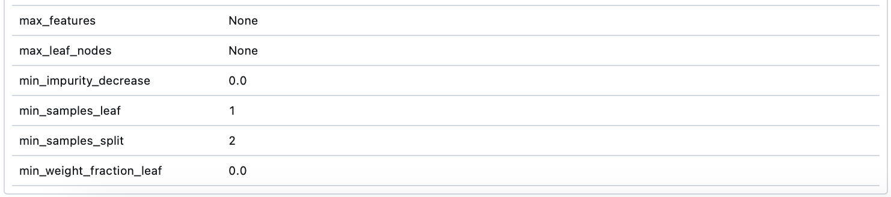
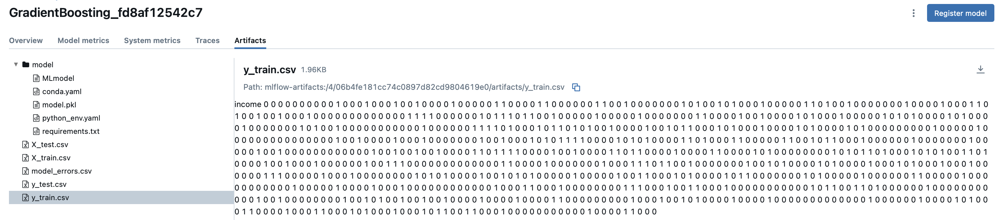
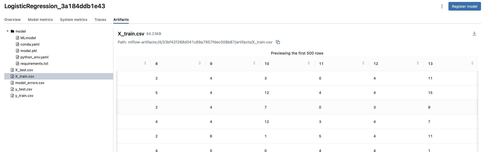

# mlflow_example
Пример использования mlflow для трекинга экспериментов

Запуск пайплайна &mdash; `python3 runner.py`

--------

### Параметры лучшего запуска по ROC-AUC:

```
Название папки: homework_ulyanova
Название: GradientBoosting_c2fd18c42675
Run ID: 360a2cd8392b4b9e8704faaf4b5b26ae
```





-----

### Добавить сохранение датасета в запуск эксперимента 

В трех последних запусках выполнено логирование обучающих и тестовых данных

```
33bf42f288d041c89a7857fdec008b87
06b4fe181cc74c0897d82cd9804619e0
2d5cada8d03b44b895818d790f3bb88c
```


