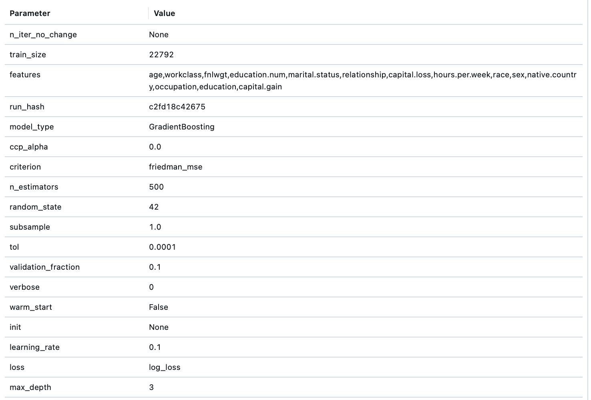
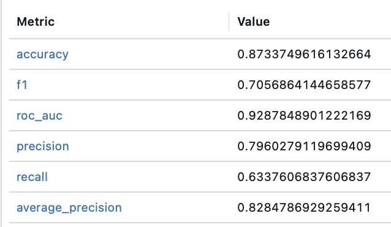

# mlflow_example
Пример использования mlflow для трекинга экспериментов

Запуск пайплайна &mdash; `python3 runner.py`

Параметры лучшего запуска по ROC-AUC:

```
Название папки: homework_ulyanova
Название: GradientBoosting_c2fd18c42675
Run ID: 360a2cd8392b4b9e8704faaf4b5b26ae
```



